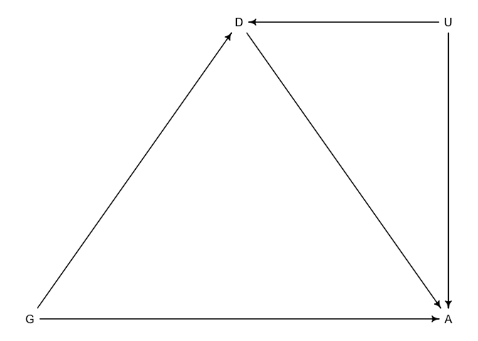
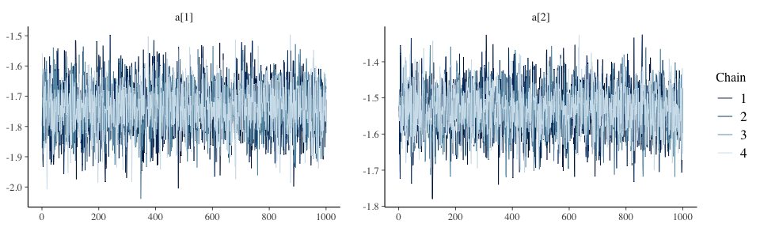
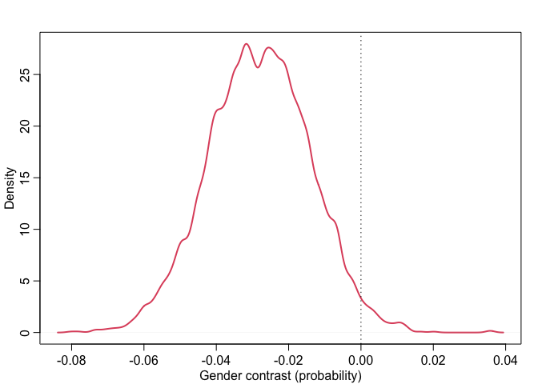
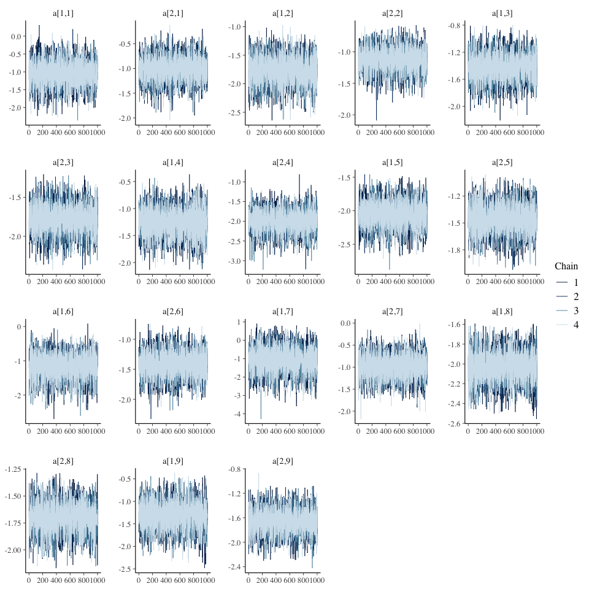
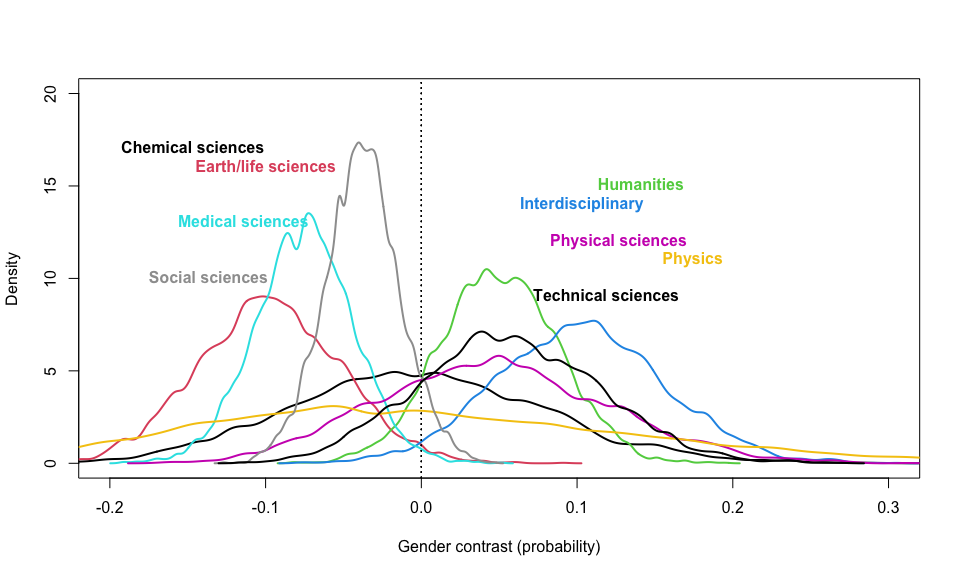
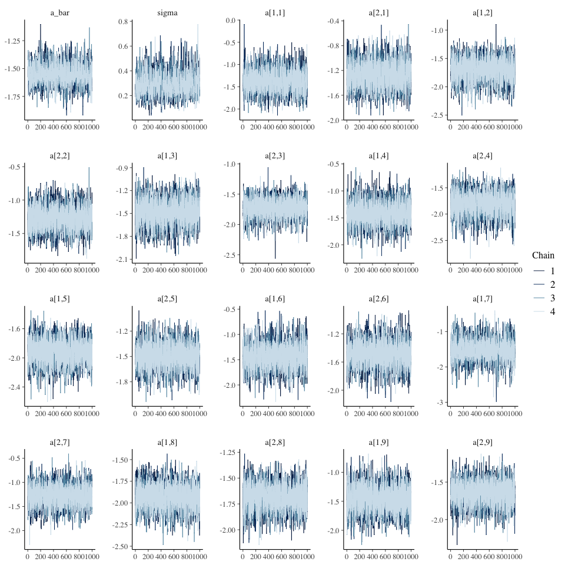
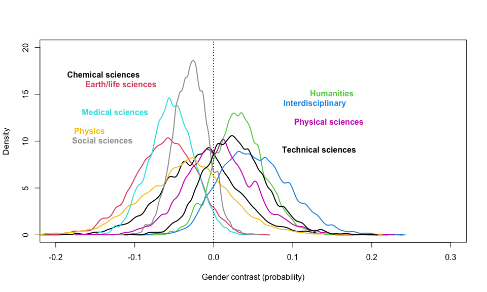
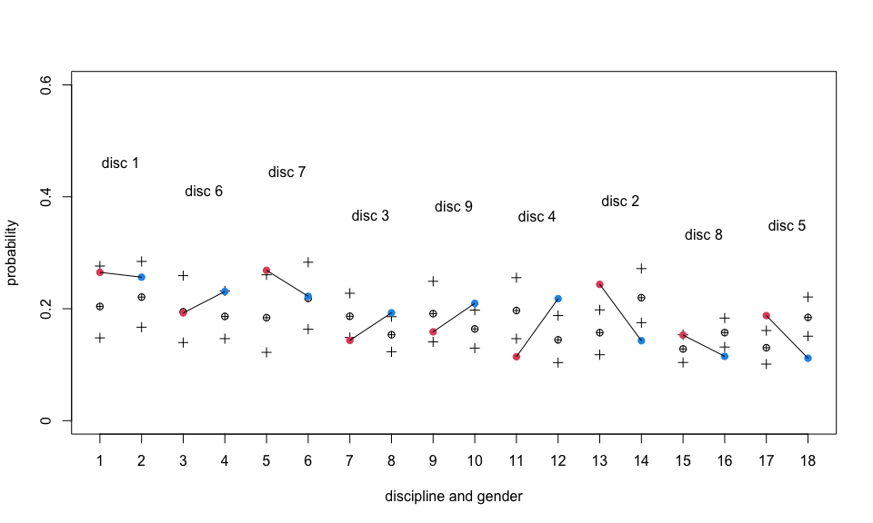
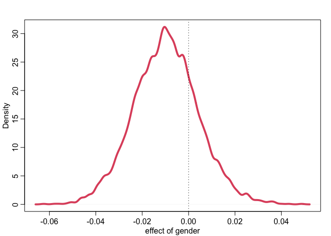
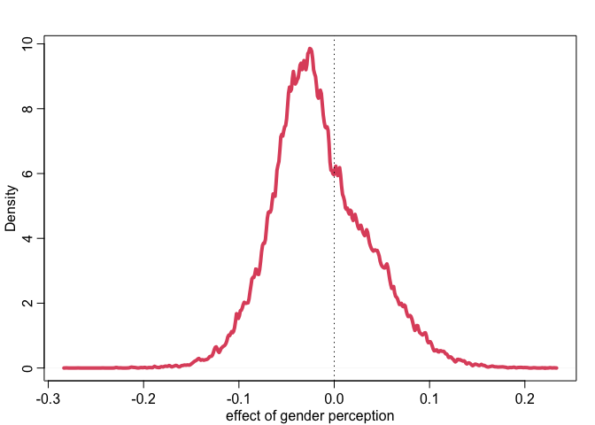

NWOGrants
================

# Installation

``` r
library(rethinking)
```

    ## Loading required package: rstan

    ## Loading required package: StanHeaders

    ## Loading required package: ggplot2

    ## rstan (Version 2.21.3, GitRev: 2e1f913d3ca3)

    ## For execution on a local, multicore CPU with excess RAM we recommend calling
    ## options(mc.cores = parallel::detectCores()).
    ## To avoid recompilation of unchanged Stan programs, we recommend calling
    ## rstan_options(auto_write = TRUE)

    ## Loading required package: parallel

    ## rethinking (Version 2.13)

    ## 
    ## Attaching package: 'rethinking'

    ## The following object is masked from 'package:stats':
    ## 
    ##     rstudent

``` r
library(cmdstanr)
```

    ## This is cmdstanr version 0.4.0

    ## - Online documentation and vignettes at mc-stan.org/cmdstanr

    ## - CmdStan path set to: /Users/mac/.cmdstanr/cmdstan-2.29.1

    ## - Use set_cmdstan_path() to change the path

``` r
library(bayesplot)
```

    ## This is bayesplot version 1.8.1

    ## - Online documentation and vignettes at mc-stan.org/bayesplot

    ## - bayesplot theme set to bayesplot::theme_default()

    ##    * Does _not_ affect other ggplot2 plots

    ##    * See ?bayesplot_theme_set for details on theme setting

``` r
library(posterior)
```

    ## This is posterior version 1.2.0

    ## 
    ## Attaching package: 'posterior'

    ## The following object is masked from 'package:bayesplot':
    ## 
    ##     rhat

    ## The following objects are masked from 'package:rstan':
    ## 
    ##     ess_bulk, ess_tail

    ## The following objects are masked from 'package:stats':
    ## 
    ##     mad, sd, var

``` r
library(dagitty)
library(loo)
```

    ## This is loo version 2.4.1

    ## - Online documentation and vignettes at mc-stan.org/loo

    ## - As of v2.0.0 loo defaults to 1 core but we recommend using as many as possible. Use the 'cores' argument or set options(mc.cores = NUM_CORES) for an entire session.

    ## 
    ## Attaching package: 'loo'

    ## The following object is masked from 'package:rethinking':
    ## 
    ##     compare

    ## The following object is masked from 'package:rstan':
    ## 
    ##     loo

# Data story

In 2015, Romy van der Kee and Naomi Ellemers published a study about
discrimination in the grant funding in the Netherlands. The authors
collected 2,823 cases of prestigious grant for personal research funding
among 9 disciplines. Their research finding is that gender bias favoring
male applicants over female applicants in the prioritization of their
quality researcher evaluation and success rates. The project will
revisit that study under Bayesian perspective

``` r
data("NWOGrants")
d1 <- NWOGrants
str(d1)
```

    ## 'data.frame':    18 obs. of  4 variables:
    ##  $ discipline  : Factor w/ 9 levels "Chemical sciences",..: 1 1 6 6 7 7 3 3 9 9 ...
    ##  $ gender      : Factor w/ 2 levels "f","m": 2 1 2 1 2 1 2 1 2 1 ...
    ##  $ applications: int  83 39 135 39 67 9 230 166 189 62 ...
    ##  $ awards      : int  22 10 26 9 18 2 33 32 30 13 ...

# Heuristic causal model (DAG)

The DAG below graphically draws the research question of whether there
exists gender discrimination in grant funding in the Netherlands. While
we are most concerned about the direct effect of gender (G) onto awards
(A), it is possible to see a mediator of discipline (D) that exaggerates
the impact of gender. Furthermore, there likely exists an unobserved
variable such as the research quality that affects both D and A. Such a
variable or any other possible proxies were not present in the data set.
It can limit our conclusion about the causal effect of G on A

``` r
dag1 <- dagitty("dag{G->A
                  G->D->A
                  D<-U->A}")
coordinates(dag1) <- list(x=c(G=0,D=1,A=2,U=2),y=c(G=0,D=-1,A=0,U=-1))
drawdag(dag1)
```

<!-- -->

# Total effect of gender on grant awards

## Scientific model

At the beginning, we will focus on the total effect of gender on grant
awards. That is represented by two causal path, G->A and G->D->A. I
avoid using the term “indirect causal effect” here. We can find more
information about it in Chapter 9 in Pearl et al. (2018). Given a
observational data set, we are going to use an aggregated binomial
regression for the problem. Here A indicates the awards, N is the number
of applications, and p is the probability of receiving grant. We denote
a as the parameter that needs being assigned a prior

$$
A \\sim Bin(N,p)\\\\
logit(p) = a\_{G}\\\\
a \\sim tbd
$$
### Define priors

Apparently, the below figure shows a transition from a basic space to a
logit space in which a flat Normal(0,10) prior produces a very non-flat
prior distribution on the outcome space. The second prior,
Normal(0,1.5), produces a more reasonable outcome

``` r
plot(NULL, xlab="alpha", ylab="density",
     xlim = c(0,1), ylim=c(0,5))
dens(inv_logit(rnorm(n=1e4,mean=0,sd=1.5)), lwd=4, col=2, add=T)
text(x=0.2,y=0.7, "alpha ~ N(0,1.5)", col=2, font=2)
dens(inv_logit(rnorm(n=1e4,mean=0,sd=10)), lwd=4, col=4, add=T)
text(x=0.2,y=2.0, "alpha ~ N(0,10)", col=4, font=2)
```

<!-- -->

### Model fitting

``` r
dat <- list(
  N = d1$applications,
  A = d1$awards,
  G = ifelse(d1$gender=='f',1,2),
  D = as.integer(d1$discipline)
)
```

``` r
m1 <- cmdstan_model("stancode/m1.stan")
fit1 <- m1$sample(data=dat, chains=4, parallel_chains=getOption("mc.core",4))
```

    ## Running MCMC with 4 parallel chains...
    ## 
    ## Chain 1 Iteration:    1 / 2000 [  0%]  (Warmup) 
    ## Chain 1 Iteration:  100 / 2000 [  5%]  (Warmup) 
    ## Chain 1 Iteration:  200 / 2000 [ 10%]  (Warmup) 
    ## Chain 1 Iteration:  300 / 2000 [ 15%]  (Warmup) 
    ## Chain 1 Iteration:  400 / 2000 [ 20%]  (Warmup) 
    ## Chain 1 Iteration:  500 / 2000 [ 25%]  (Warmup) 
    ## Chain 1 Iteration:  600 / 2000 [ 30%]  (Warmup) 
    ## Chain 1 Iteration:  700 / 2000 [ 35%]  (Warmup) 
    ## Chain 1 Iteration:  800 / 2000 [ 40%]  (Warmup) 
    ## Chain 1 Iteration:  900 / 2000 [ 45%]  (Warmup) 
    ## Chain 1 Iteration: 1000 / 2000 [ 50%]  (Warmup) 
    ## Chain 1 Iteration: 1001 / 2000 [ 50%]  (Sampling) 
    ## Chain 1 Iteration: 1100 / 2000 [ 55%]  (Sampling) 
    ## Chain 1 Iteration: 1200 / 2000 [ 60%]  (Sampling) 
    ## Chain 1 Iteration: 1300 / 2000 [ 65%]  (Sampling) 
    ## Chain 1 Iteration: 1400 / 2000 [ 70%]  (Sampling) 
    ## Chain 1 Iteration: 1500 / 2000 [ 75%]  (Sampling) 
    ## Chain 1 Iteration: 1600 / 2000 [ 80%]  (Sampling) 
    ## Chain 1 Iteration: 1700 / 2000 [ 85%]  (Sampling) 
    ## Chain 1 Iteration: 1800 / 2000 [ 90%]  (Sampling) 
    ## Chain 1 Iteration: 1900 / 2000 [ 95%]  (Sampling) 
    ## Chain 1 Iteration: 2000 / 2000 [100%]  (Sampling) 
    ## Chain 2 Iteration:    1 / 2000 [  0%]  (Warmup) 
    ## Chain 2 Iteration:  100 / 2000 [  5%]  (Warmup) 
    ## Chain 2 Iteration:  200 / 2000 [ 10%]  (Warmup) 
    ## Chain 2 Iteration:  300 / 2000 [ 15%]  (Warmup) 
    ## Chain 2 Iteration:  400 / 2000 [ 20%]  (Warmup) 
    ## Chain 2 Iteration:  500 / 2000 [ 25%]  (Warmup) 
    ## Chain 2 Iteration:  600 / 2000 [ 30%]  (Warmup) 
    ## Chain 2 Iteration:  700 / 2000 [ 35%]  (Warmup) 
    ## Chain 2 Iteration:  800 / 2000 [ 40%]  (Warmup) 
    ## Chain 2 Iteration:  900 / 2000 [ 45%]  (Warmup) 
    ## Chain 2 Iteration: 1000 / 2000 [ 50%]  (Warmup) 
    ## Chain 2 Iteration: 1001 / 2000 [ 50%]  (Sampling) 
    ## Chain 2 Iteration: 1100 / 2000 [ 55%]  (Sampling) 
    ## Chain 2 Iteration: 1200 / 2000 [ 60%]  (Sampling) 
    ## Chain 2 Iteration: 1300 / 2000 [ 65%]  (Sampling) 
    ## Chain 2 Iteration: 1400 / 2000 [ 70%]  (Sampling) 
    ## Chain 2 Iteration: 1500 / 2000 [ 75%]  (Sampling) 
    ## Chain 2 Iteration: 1600 / 2000 [ 80%]  (Sampling) 
    ## Chain 2 Iteration: 1700 / 2000 [ 85%]  (Sampling) 
    ## Chain 2 Iteration: 1800 / 2000 [ 90%]  (Sampling) 
    ## Chain 2 Iteration: 1900 / 2000 [ 95%]  (Sampling) 
    ## Chain 2 Iteration: 2000 / 2000 [100%]  (Sampling) 
    ## Chain 3 Iteration:    1 / 2000 [  0%]  (Warmup) 
    ## Chain 3 Iteration:  100 / 2000 [  5%]  (Warmup) 
    ## Chain 3 Iteration:  200 / 2000 [ 10%]  (Warmup) 
    ## Chain 3 Iteration:  300 / 2000 [ 15%]  (Warmup) 
    ## Chain 3 Iteration:  400 / 2000 [ 20%]  (Warmup) 
    ## Chain 3 Iteration:  500 / 2000 [ 25%]  (Warmup) 
    ## Chain 3 Iteration:  600 / 2000 [ 30%]  (Warmup) 
    ## Chain 3 Iteration:  700 / 2000 [ 35%]  (Warmup) 
    ## Chain 3 Iteration:  800 / 2000 [ 40%]  (Warmup) 
    ## Chain 3 Iteration:  900 / 2000 [ 45%]  (Warmup) 
    ## Chain 3 Iteration: 1000 / 2000 [ 50%]  (Warmup) 
    ## Chain 3 Iteration: 1001 / 2000 [ 50%]  (Sampling) 
    ## Chain 3 Iteration: 1100 / 2000 [ 55%]  (Sampling) 
    ## Chain 3 Iteration: 1200 / 2000 [ 60%]  (Sampling) 
    ## Chain 3 Iteration: 1300 / 2000 [ 65%]  (Sampling) 
    ## Chain 3 Iteration: 1400 / 2000 [ 70%]  (Sampling) 
    ## Chain 3 Iteration: 1500 / 2000 [ 75%]  (Sampling) 
    ## Chain 3 Iteration: 1600 / 2000 [ 80%]  (Sampling) 
    ## Chain 3 Iteration: 1700 / 2000 [ 85%]  (Sampling) 
    ## Chain 3 Iteration: 1800 / 2000 [ 90%]  (Sampling) 
    ## Chain 3 Iteration: 1900 / 2000 [ 95%]  (Sampling) 
    ## Chain 3 Iteration: 2000 / 2000 [100%]  (Sampling) 
    ## Chain 4 Iteration:    1 / 2000 [  0%]  (Warmup) 
    ## Chain 4 Iteration:  100 / 2000 [  5%]  (Warmup) 
    ## Chain 4 Iteration:  200 / 2000 [ 10%]  (Warmup) 
    ## Chain 4 Iteration:  300 / 2000 [ 15%]  (Warmup) 
    ## Chain 4 Iteration:  400 / 2000 [ 20%]  (Warmup) 
    ## Chain 4 Iteration:  500 / 2000 [ 25%]  (Warmup) 
    ## Chain 4 Iteration:  600 / 2000 [ 30%]  (Warmup) 
    ## Chain 4 Iteration:  700 / 2000 [ 35%]  (Warmup) 
    ## Chain 4 Iteration:  800 / 2000 [ 40%]  (Warmup) 
    ## Chain 4 Iteration:  900 / 2000 [ 45%]  (Warmup) 
    ## Chain 4 Iteration: 1000 / 2000 [ 50%]  (Warmup) 
    ## Chain 4 Iteration: 1001 / 2000 [ 50%]  (Sampling) 
    ## Chain 4 Iteration: 1100 / 2000 [ 55%]  (Sampling) 
    ## Chain 4 Iteration: 1200 / 2000 [ 60%]  (Sampling) 
    ## Chain 4 Iteration: 1300 / 2000 [ 65%]  (Sampling) 
    ## Chain 4 Iteration: 1400 / 2000 [ 70%]  (Sampling) 
    ## Chain 4 Iteration: 1500 / 2000 [ 75%]  (Sampling) 
    ## Chain 4 Iteration: 1600 / 2000 [ 80%]  (Sampling) 
    ## Chain 4 Iteration: 1700 / 2000 [ 85%]  (Sampling) 
    ## Chain 4 Iteration: 1800 / 2000 [ 90%]  (Sampling) 
    ## Chain 4 Iteration: 1900 / 2000 [ 95%]  (Sampling) 
    ## Chain 4 Iteration: 2000 / 2000 [100%]  (Sampling) 
    ## Chain 1 finished in 0.1 seconds.
    ## Chain 2 finished in 0.1 seconds.
    ## Chain 3 finished in 0.1 seconds.
    ## Chain 4 finished in 0.1 seconds.
    ## 
    ## All 4 chains finished successfully.
    ## Mean chain execution time: 0.1 seconds.
    ## Total execution time: 0.5 seconds.

``` r
summary1 <- as.data.frame(fit1$summary(c("a")))
summary1
```

    ##   variable      mean    median         sd        mad        q5       q95
    ## 1     a[1] -1.740487 -1.739325 0.08071646 0.08209897 -1.874980 -1.610673
    ## 2     a[2] -1.533962 -1.531710 0.06387216 0.06256572 -1.640843 -1.431786
    ##       rhat ess_bulk ess_tail
    ## 1 1.000782 3761.436 2786.949
    ## 2 1.000290 3956.413 2786.528

``` r
draws1 <- fit1$draws()
```

### Model dianosing

The Markov Chain Monte Carlo (MCMC) sampling performs properly as all
four chains mix together. The number of efficient samples and rhat
indicator show no potential warnings. We can move forward onto the
inference step

``` r
bayesplot::mcmc_trace(draws1, regex_pars = c('a'))
```

<!-- -->

### Model sampling

Sampling from the Bayesian model above, we focus on the gender contrast
on probability scale. The point is that female scholars seem to be less
advantaged than their male counterparts. The quantitative bias is almost
3%. The is a critical number as the success rate of a grant is only
around 20%. However, as we discussed before, that bias covers a total
effect of gender on awards. We must know the direct effect of gender on
awards before making any conclusions about gender discrimination

``` r
x1 = inv_logit(extract_variable(draws1, variable = sprintf("a[1]")))
x2 = inv_logit(extract_variable(draws1, variable = sprintf("a[2]")))
diff_prob_G1 <- x1 - x2
```

``` r
dens(diff_prob_G1, lwd=2, col=2, xlab="Gender contrast (probability)", ylab="Density")
abline(v=0,lty=3)
```

<!-- -->

# Direct effect of gender on grant awards

## No-pooling statistical models

We are considering a base case without an unobserved variable. So, to
measure the direct effect of gender on grant awards, we need to separate
it from the total effect and close the path going through the discipline
by conditioning on D. Statistically, we need to add D into the model. By
combining G and D, the parameter, a, will be a matrix with shape of 2
genders and 9 disciplines

$$
A \\sim Bin(N,p)\\\\
logit(p) = a\_{G,D}\\\\
a \\sim N(0,1.5)
$$

### Model fitting

``` r
m2 <- cmdstan_model("stancode/m2.stan")
fit2 <- m2$sample(data=dat, chains=4, parallel_chains=getOption("mc.core",4))
```

    ## Running MCMC with 4 parallel chains...
    ## 
    ## Chain 1 Iteration:    1 / 2000 [  0%]  (Warmup) 
    ## Chain 1 Iteration:  100 / 2000 [  5%]  (Warmup) 
    ## Chain 1 Iteration:  200 / 2000 [ 10%]  (Warmup) 
    ## Chain 1 Iteration:  300 / 2000 [ 15%]  (Warmup) 
    ## Chain 1 Iteration:  400 / 2000 [ 20%]  (Warmup) 
    ## Chain 1 Iteration:  500 / 2000 [ 25%]  (Warmup) 
    ## Chain 1 Iteration:  600 / 2000 [ 30%]  (Warmup) 
    ## Chain 1 Iteration:  700 / 2000 [ 35%]  (Warmup) 
    ## Chain 1 Iteration:  800 / 2000 [ 40%]  (Warmup) 
    ## Chain 1 Iteration:  900 / 2000 [ 45%]  (Warmup) 
    ## Chain 1 Iteration: 1000 / 2000 [ 50%]  (Warmup) 
    ## Chain 1 Iteration: 1001 / 2000 [ 50%]  (Sampling) 
    ## Chain 1 Iteration: 1100 / 2000 [ 55%]  (Sampling) 
    ## Chain 1 Iteration: 1200 / 2000 [ 60%]  (Sampling) 
    ## Chain 2 Iteration:    1 / 2000 [  0%]  (Warmup) 
    ## Chain 2 Iteration:  100 / 2000 [  5%]  (Warmup) 
    ## Chain 2 Iteration:  200 / 2000 [ 10%]  (Warmup) 
    ## Chain 2 Iteration:  300 / 2000 [ 15%]  (Warmup) 
    ## Chain 2 Iteration:  400 / 2000 [ 20%]  (Warmup) 
    ## Chain 2 Iteration:  500 / 2000 [ 25%]  (Warmup) 
    ## Chain 2 Iteration:  600 / 2000 [ 30%]  (Warmup) 
    ## Chain 2 Iteration:  700 / 2000 [ 35%]  (Warmup) 
    ## Chain 2 Iteration:  800 / 2000 [ 40%]  (Warmup) 
    ## Chain 2 Iteration:  900 / 2000 [ 45%]  (Warmup) 
    ## Chain 2 Iteration: 1000 / 2000 [ 50%]  (Warmup) 
    ## Chain 2 Iteration: 1001 / 2000 [ 50%]  (Sampling) 
    ## Chain 2 Iteration: 1100 / 2000 [ 55%]  (Sampling) 
    ## Chain 2 Iteration: 1200 / 2000 [ 60%]  (Sampling) 
    ## Chain 2 Iteration: 1300 / 2000 [ 65%]  (Sampling) 
    ## Chain 3 Iteration:    1 / 2000 [  0%]  (Warmup) 
    ## Chain 3 Iteration:  100 / 2000 [  5%]  (Warmup) 
    ## Chain 3 Iteration:  200 / 2000 [ 10%]  (Warmup) 
    ## Chain 3 Iteration:  300 / 2000 [ 15%]  (Warmup) 
    ## Chain 3 Iteration:  400 / 2000 [ 20%]  (Warmup) 
    ## Chain 3 Iteration:  500 / 2000 [ 25%]  (Warmup) 
    ## Chain 3 Iteration:  600 / 2000 [ 30%]  (Warmup) 
    ## Chain 3 Iteration:  700 / 2000 [ 35%]  (Warmup) 
    ## Chain 3 Iteration:  800 / 2000 [ 40%]  (Warmup) 
    ## Chain 3 Iteration:  900 / 2000 [ 45%]  (Warmup) 
    ## Chain 3 Iteration: 1000 / 2000 [ 50%]  (Warmup) 
    ## Chain 3 Iteration: 1001 / 2000 [ 50%]  (Sampling) 
    ## Chain 3 Iteration: 1100 / 2000 [ 55%]  (Sampling) 
    ## Chain 3 Iteration: 1200 / 2000 [ 60%]  (Sampling) 
    ## Chain 3 Iteration: 1300 / 2000 [ 65%]  (Sampling) 
    ## Chain 3 Iteration: 1400 / 2000 [ 70%]  (Sampling) 
    ## Chain 3 Iteration: 1500 / 2000 [ 75%]  (Sampling) 
    ## Chain 4 Iteration:    1 / 2000 [  0%]  (Warmup) 
    ## Chain 4 Iteration:  100 / 2000 [  5%]  (Warmup) 
    ## Chain 4 Iteration:  200 / 2000 [ 10%]  (Warmup) 
    ## Chain 4 Iteration:  300 / 2000 [ 15%]  (Warmup) 
    ## Chain 4 Iteration:  400 / 2000 [ 20%]  (Warmup) 
    ## Chain 4 Iteration:  500 / 2000 [ 25%]  (Warmup) 
    ## Chain 4 Iteration:  600 / 2000 [ 30%]  (Warmup) 
    ## Chain 4 Iteration:  700 / 2000 [ 35%]  (Warmup) 
    ## Chain 4 Iteration:  800 / 2000 [ 40%]  (Warmup) 
    ## Chain 4 Iteration:  900 / 2000 [ 45%]  (Warmup) 
    ## Chain 4 Iteration: 1000 / 2000 [ 50%]  (Warmup) 
    ## Chain 4 Iteration: 1001 / 2000 [ 50%]  (Sampling) 
    ## Chain 4 Iteration: 1100 / 2000 [ 55%]  (Sampling) 
    ## Chain 4 Iteration: 1200 / 2000 [ 60%]  (Sampling) 
    ## Chain 4 Iteration: 1300 / 2000 [ 65%]  (Sampling) 
    ## Chain 4 Iteration: 1400 / 2000 [ 70%]  (Sampling) 
    ## Chain 4 Iteration: 1500 / 2000 [ 75%]  (Sampling) 
    ## Chain 1 Iteration: 1300 / 2000 [ 65%]  (Sampling) 
    ## Chain 1 Iteration: 1400 / 2000 [ 70%]  (Sampling) 
    ## Chain 1 Iteration: 1500 / 2000 [ 75%]  (Sampling) 
    ## Chain 1 Iteration: 1600 / 2000 [ 80%]  (Sampling) 
    ## Chain 1 Iteration: 1700 / 2000 [ 85%]  (Sampling) 
    ## Chain 1 Iteration: 1800 / 2000 [ 90%]  (Sampling) 
    ## Chain 1 Iteration: 1900 / 2000 [ 95%]  (Sampling) 
    ## Chain 1 Iteration: 2000 / 2000 [100%]  (Sampling) 
    ## Chain 2 Iteration: 1400 / 2000 [ 70%]  (Sampling) 
    ## Chain 2 Iteration: 1500 / 2000 [ 75%]  (Sampling) 
    ## Chain 2 Iteration: 1600 / 2000 [ 80%]  (Sampling) 
    ## Chain 2 Iteration: 1700 / 2000 [ 85%]  (Sampling) 
    ## Chain 2 Iteration: 1800 / 2000 [ 90%]  (Sampling) 
    ## Chain 2 Iteration: 1900 / 2000 [ 95%]  (Sampling) 
    ## Chain 2 Iteration: 2000 / 2000 [100%]  (Sampling) 
    ## Chain 3 Iteration: 1600 / 2000 [ 80%]  (Sampling) 
    ## Chain 3 Iteration: 1700 / 2000 [ 85%]  (Sampling) 
    ## Chain 3 Iteration: 1800 / 2000 [ 90%]  (Sampling) 
    ## Chain 3 Iteration: 1900 / 2000 [ 95%]  (Sampling) 
    ## Chain 3 Iteration: 2000 / 2000 [100%]  (Sampling) 
    ## Chain 4 Iteration: 1600 / 2000 [ 80%]  (Sampling) 
    ## Chain 4 Iteration: 1700 / 2000 [ 85%]  (Sampling) 
    ## Chain 4 Iteration: 1800 / 2000 [ 90%]  (Sampling) 
    ## Chain 4 Iteration: 1900 / 2000 [ 95%]  (Sampling) 
    ## Chain 4 Iteration: 2000 / 2000 [100%]  (Sampling) 
    ## Chain 1 finished in 0.2 seconds.
    ## Chain 2 finished in 0.2 seconds.
    ## Chain 3 finished in 0.2 seconds.
    ## Chain 4 finished in 0.2 seconds.
    ## 
    ## All 4 chains finished successfully.
    ## Mean chain execution time: 0.2 seconds.
    ## Total execution time: 0.5 seconds.

``` r
summary2 <- as.data.frame(fit2$summary(c("a")))
summary2
```

    ##    variable       mean    median        sd       mad        q5         q95
    ## 1    a[1,1] -1.0318888 -1.019340 0.3491648 0.3401729 -1.616479 -0.47920140
    ## 2    a[2,1] -1.0067338 -1.000480 0.2468908 0.2463562 -1.416386 -0.60614280
    ## 3    a[1,2] -1.7629349 -1.758740 0.2491066 0.2554372 -2.181881 -1.37163300
    ## 4    a[2,2] -1.1241903 -1.120390 0.1833015 0.1751840 -1.429361 -0.82704005
    ## 5    a[1,3] -1.4190989 -1.413185 0.1944941 0.1930716 -1.745942 -1.10150850
    ## 6    a[2,3] -1.7748782 -1.770585 0.1837853 0.1823227 -2.083716 -1.47697250
    ## 7    a[1,4] -1.2542467 -1.251210 0.2603387 0.2542733 -1.697124 -0.82507120
    ## 8    a[2,4] -1.9947056 -1.984400 0.2847514 0.2827541 -2.479909 -1.55091050
    ## 9    a[1,5] -2.0544470 -2.054780 0.1952149 0.1960887 -2.385671 -1.73965100
    ## 10   a[2,5] -1.4566127 -1.456470 0.1632358 0.1580822 -1.727372 -1.18958400
    ## 11   a[1,6] -1.1710119 -1.158510 0.3703212 0.3695106 -1.797788 -0.58438115
    ## 12   a[2,6] -1.4206399 -1.417530 0.2089797 0.2058590 -1.764784 -1.07951800
    ## 13   a[1,7] -1.0674428 -1.053595 0.6888958 0.7009206 -2.235340  0.01309245
    ## 14   a[2,7] -0.9843234 -0.979276 0.2736796 0.2700237 -1.446478 -0.54092475
    ## 15   a[1,8] -2.0288207 -2.024745 0.1538103 0.1552430 -2.289163 -1.78179250
    ## 16   a[2,8] -1.7029848 -1.699885 0.1385540 0.1375037 -1.938184 -1.47945750
    ## 17   a[1,9] -1.2970538 -1.285795 0.3032841 0.2985141 -1.814128 -0.81918850
    ## 18   a[2,9] -1.6538289 -1.650090 0.1998184 0.1929382 -1.990870 -1.32737800
    ##         rhat  ess_bulk ess_tail
    ## 1  0.9996158  8922.107 3121.354
    ## 2  1.0022319  9143.310 2595.874
    ## 3  1.0009365  9223.277 3205.332
    ## 4  1.0030022  8561.112 2743.666
    ## 5  1.0002844 10782.438 2821.761
    ## 6  1.0040041  9569.205 2834.028
    ## 7  1.0064451  9517.080 3053.873
    ## 8  1.0009983  7835.767 3178.055
    ## 9  1.0016854 10018.065 2695.997
    ## 10 1.0049750  7674.048 2608.519
    ## 11 1.0006224  9681.339 2994.107
    ## 12 1.0010372  9722.438 2846.475
    ## 13 1.0004130  7832.386 2941.720
    ## 14 1.0022162  9715.811 2947.715
    ## 15 1.0016485  9617.171 2563.307
    ## 16 1.0013999 10165.144 2891.384
    ## 17 1.0008857  8730.750 2926.024
    ## 18 0.9993869 10450.182 2773.382

``` r
draws2 <- fit2$draws()
```

### Model dianosing

There are no clear clues regarding of issues in the sampling process. We
can safely move forward

``` r
bayesplot:: mcmc_trace(draws2, regex_pars = c("a"))
```

<!-- -->

### Model sampling

Different to the first contrast figure, adding D into the model actually
reveals the hidden discrepancies among grant awards in each disciplines.
Female scholars are expected to have higher success rates in disciplines
of humanities, interdisciplinary, technical sciences. Male scholars are
positive about Earth/life sciences, Medical sciences, and Social
sciences

``` r
diff_prob_G2 <- matrix(0,nrow=4000,ncol=9)
for(i in 1:9){
  x1 = inv_logit(extract_variable(draws2, variable = sprintf("a[1,%d]",i)))
  x2 = inv_logit(extract_variable(draws2, variable = sprintf("a[2,%d]",i)))
  diff_prob_G2[,i] = x1 - x2
}
```

``` r
plot(NULL, xlim=c(-0.2,0.3), ylim=c(0,20), xlab="Gender contrast (probability)", ylab="Density")
disc <- as.character(d1$discipline)
disc <- disc[order(dat$D)]
for(i in 1:9){
  dens(diff_prob_G2[,i], lwd=2, col=i, add=T)
  xloc <- ifelse(mean(diff_prob_G2[,i]) < 0, -0.2, 0.2)
  xpos <- ifelse(mean(diff_prob_G2[,i]) < 0, 4, 2)
  text(xloc - 0.5*mean(diff_prob_G2[,i]), 18-i, disc[2*i], col=i, pos=xpos, font=2)
  abline(v=0,lty=3)
}
```

<!-- -->

In addition to the contrast figure, we want to compare our model’s
posterior prediction with the input data. There are a large room to
improve the performance of the model as seen in the figure below. The
filled red and blue points represent for the empirical success rates of
females and males, respectively. Obviously, females are favored over
males in some disciplines, vice versa. However, we can clearly see that
the current posterior prediction is largely variant in compared with the
input data. For example, the discipline #7 experiences a wide range of
89% percentile intervals

To cure the issue, we are going to build a hierarchical or partial
pooling model that is expected to allows our model learning across
observations

``` r
dat_sim <- list(gid = rep(1:2, times=9), disc_id = dat$D)
admit_post2 <- matrix(0, nrow=4000, ncol=18)
for(i in 1:18){
  admit_post2[,i] = inv_logit(extract_variable(draws2, sprintf("a[%d,%d]",dat_sim$gid[i],dat_sim$disc_id[i])))
}
```

``` r
admit_mu2 <- apply(admit_post2, 2, mean)
admit_pi2 <- apply(admit_post2, 2,PI, prob=0.89)
```

``` r
plot(NULL, xlim=c(1,18),ylim=c(0,0.6),
     xlab="discipline and gender", ylab="probability", xaxt="n", yaxt="n")
axis(side=2,at=seq(0,0.6,by=0.2), labels=c(0.0,0.2,0.4,0.6))
axis(side=1,at=seq(1,18,by=1), labels=seq(1,18,by=1))

points(x=1:18, y=admit_mu2, pch=10)
for(i in 1:18){points(x=rep(i,2), y=admit_pi2[,i], pch=3)}

for(i in 1:18){
  points(x=i, y=dat$A[i]/dat$N[i], pch=19, col=ifelse(i%%2 == 0,4,2))
}

for(i in 1:9){lines(x=c(2*i-1,2*i),y=c(dat$A[2*i-1]/dat$N[2*i-1],dat$A[2*i]/dat$N[2*i]))}
for(i in 1:9){text(x=2*i-0.5,y=mean(c(dat$A[2*i-1]/dat$N[2*i-1],dat$A[2*i]/dat$N[2*i]))+0.2,
                   labels = concat("disc ",dat$D[2*i]), font=1)}
```

<!-- -->

## Partial pooling statistical model

In the model, we introduce three additional variables of a_bar and
sigma. Intuitively, the preceding model implies an infinite variance
among the a parameters. Here, the parameter shares a common distribution
constructed by the three new parameters which are estimated from the
data. Another noteworthy point is that we are using a non-centered
parameterization to improve the sampling process of the MCMC

$$
A \\sim Bin(N,p)\\\\
logit(p) = a\_{G,D}\\\\
a = \\bar{a} + z\*\\sigma\\\\
\\bar{a} \\sim N(0,1.5)\\\\
\\sigma \\sim Exp(1.5)\\\\
z \\sim N(0,1)
$$

### Model fitting

``` r
m3 <- cmdstan_model('stancode/m3.stan')
fit3 <- m3$sample(data=dat, chains=4, parallel_chains=getOption('mc.core',4))
```

    ## Running MCMC with 4 parallel chains...
    ## 
    ## Chain 1 Iteration:    1 / 2000 [  0%]  (Warmup) 
    ## Chain 1 Iteration:  100 / 2000 [  5%]  (Warmup) 
    ## Chain 1 Iteration:  200 / 2000 [ 10%]  (Warmup) 
    ## Chain 1 Iteration:  300 / 2000 [ 15%]  (Warmup) 
    ## Chain 1 Iteration:  400 / 2000 [ 20%]  (Warmup) 
    ## Chain 1 Iteration:  500 / 2000 [ 25%]  (Warmup) 
    ## Chain 1 Iteration:  600 / 2000 [ 30%]  (Warmup) 
    ## Chain 2 Iteration:    1 / 2000 [  0%]  (Warmup) 
    ## Chain 2 Iteration:  100 / 2000 [  5%]  (Warmup) 
    ## Chain 2 Iteration:  200 / 2000 [ 10%]  (Warmup) 
    ## Chain 2 Iteration:  300 / 2000 [ 15%]  (Warmup) 
    ## Chain 2 Iteration:  400 / 2000 [ 20%]  (Warmup) 
    ## Chain 2 Iteration:  500 / 2000 [ 25%]  (Warmup) 
    ## Chain 2 Iteration:  600 / 2000 [ 30%]  (Warmup) 
    ## Chain 2 Iteration:  700 / 2000 [ 35%]  (Warmup) 
    ## Chain 3 Iteration:    1 / 2000 [  0%]  (Warmup) 
    ## Chain 3 Iteration:  100 / 2000 [  5%]  (Warmup) 
    ## Chain 3 Iteration:  200 / 2000 [ 10%]  (Warmup) 
    ## Chain 3 Iteration:  300 / 2000 [ 15%]  (Warmup) 
    ## Chain 3 Iteration:  400 / 2000 [ 20%]  (Warmup) 
    ## Chain 3 Iteration:  500 / 2000 [ 25%]  (Warmup) 
    ## Chain 3 Iteration:  600 / 2000 [ 30%]  (Warmup) 
    ## Chain 3 Iteration:  700 / 2000 [ 35%]  (Warmup) 
    ## Chain 3 Iteration:  800 / 2000 [ 40%]  (Warmup) 
    ## Chain 3 Iteration:  900 / 2000 [ 45%]  (Warmup) 
    ## Chain 3 Iteration: 1000 / 2000 [ 50%]  (Warmup) 
    ## Chain 3 Iteration: 1001 / 2000 [ 50%]  (Sampling) 
    ## Chain 4 Iteration:    1 / 2000 [  0%]  (Warmup) 
    ## Chain 4 Iteration:  100 / 2000 [  5%]  (Warmup) 
    ## Chain 4 Iteration:  200 / 2000 [ 10%]  (Warmup) 
    ## Chain 4 Iteration:  300 / 2000 [ 15%]  (Warmup) 
    ## Chain 4 Iteration:  400 / 2000 [ 20%]  (Warmup) 
    ## Chain 4 Iteration:  500 / 2000 [ 25%]  (Warmup) 
    ## Chain 4 Iteration:  600 / 2000 [ 30%]  (Warmup) 
    ## Chain 4 Iteration:  700 / 2000 [ 35%]  (Warmup) 
    ## Chain 4 Iteration:  800 / 2000 [ 40%]  (Warmup) 
    ## Chain 4 Iteration:  900 / 2000 [ 45%]  (Warmup) 
    ## Chain 4 Iteration: 1000 / 2000 [ 50%]  (Warmup) 
    ## Chain 4 Iteration: 1001 / 2000 [ 50%]  (Sampling) 
    ## Chain 1 Iteration:  700 / 2000 [ 35%]  (Warmup) 
    ## Chain 1 Iteration:  800 / 2000 [ 40%]  (Warmup) 
    ## Chain 1 Iteration:  900 / 2000 [ 45%]  (Warmup) 
    ## Chain 1 Iteration: 1000 / 2000 [ 50%]  (Warmup) 
    ## Chain 1 Iteration: 1001 / 2000 [ 50%]  (Sampling) 
    ## Chain 1 Iteration: 1100 / 2000 [ 55%]  (Sampling) 
    ## Chain 1 Iteration: 1200 / 2000 [ 60%]  (Sampling) 
    ## Chain 1 Iteration: 1300 / 2000 [ 65%]  (Sampling) 
    ## Chain 1 Iteration: 1400 / 2000 [ 70%]  (Sampling) 
    ## Chain 1 Iteration: 1500 / 2000 [ 75%]  (Sampling) 
    ## Chain 1 Iteration: 1600 / 2000 [ 80%]  (Sampling) 
    ## Chain 1 Iteration: 1700 / 2000 [ 85%]  (Sampling) 
    ## Chain 2 Iteration:  800 / 2000 [ 40%]  (Warmup) 
    ## Chain 2 Iteration:  900 / 2000 [ 45%]  (Warmup) 
    ## Chain 2 Iteration: 1000 / 2000 [ 50%]  (Warmup) 
    ## Chain 2 Iteration: 1001 / 2000 [ 50%]  (Sampling) 
    ## Chain 2 Iteration: 1100 / 2000 [ 55%]  (Sampling) 
    ## Chain 2 Iteration: 1200 / 2000 [ 60%]  (Sampling) 
    ## Chain 2 Iteration: 1300 / 2000 [ 65%]  (Sampling) 
    ## Chain 2 Iteration: 1400 / 2000 [ 70%]  (Sampling) 
    ## Chain 2 Iteration: 1500 / 2000 [ 75%]  (Sampling) 
    ## Chain 2 Iteration: 1600 / 2000 [ 80%]  (Sampling) 
    ## Chain 2 Iteration: 1700 / 2000 [ 85%]  (Sampling) 
    ## Chain 3 Iteration: 1100 / 2000 [ 55%]  (Sampling) 
    ## Chain 3 Iteration: 1200 / 2000 [ 60%]  (Sampling) 
    ## Chain 3 Iteration: 1300 / 2000 [ 65%]  (Sampling) 
    ## Chain 3 Iteration: 1400 / 2000 [ 70%]  (Sampling) 
    ## Chain 3 Iteration: 1500 / 2000 [ 75%]  (Sampling) 
    ## Chain 3 Iteration: 1600 / 2000 [ 80%]  (Sampling) 
    ## Chain 3 Iteration: 1700 / 2000 [ 85%]  (Sampling) 
    ## Chain 3 Iteration: 1800 / 2000 [ 90%]  (Sampling) 
    ## Chain 4 Iteration: 1100 / 2000 [ 55%]  (Sampling) 
    ## Chain 4 Iteration: 1200 / 2000 [ 60%]  (Sampling) 
    ## Chain 4 Iteration: 1300 / 2000 [ 65%]  (Sampling) 
    ## Chain 4 Iteration: 1400 / 2000 [ 70%]  (Sampling) 
    ## Chain 4 Iteration: 1500 / 2000 [ 75%]  (Sampling) 
    ## Chain 4 Iteration: 1600 / 2000 [ 80%]  (Sampling) 
    ## Chain 4 Iteration: 1700 / 2000 [ 85%]  (Sampling) 
    ## Chain 4 Iteration: 1800 / 2000 [ 90%]  (Sampling) 
    ## Chain 1 Iteration: 1800 / 2000 [ 90%]  (Sampling) 
    ## Chain 1 Iteration: 1900 / 2000 [ 95%]  (Sampling) 
    ## Chain 1 Iteration: 2000 / 2000 [100%]  (Sampling) 
    ## Chain 2 Iteration: 1800 / 2000 [ 90%]  (Sampling) 
    ## Chain 2 Iteration: 1900 / 2000 [ 95%]  (Sampling) 
    ## Chain 2 Iteration: 2000 / 2000 [100%]  (Sampling) 
    ## Chain 3 Iteration: 1900 / 2000 [ 95%]  (Sampling) 
    ## Chain 3 Iteration: 2000 / 2000 [100%]  (Sampling) 
    ## Chain 4 Iteration: 1900 / 2000 [ 95%]  (Sampling) 
    ## Chain 4 Iteration: 2000 / 2000 [100%]  (Sampling) 
    ## Chain 1 finished in 0.3 seconds.
    ## Chain 2 finished in 0.3 seconds.
    ## Chain 3 finished in 0.3 seconds.
    ## Chain 4 finished in 0.3 seconds.
    ## 
    ## All 4 chains finished successfully.
    ## Mean chain execution time: 0.3 seconds.
    ## Total execution time: 0.6 seconds.

``` r
summary3 <- as.data.frame(fit3$summary(c("a", "a_bar", "sigma")))
summary3
```

    ##    variable       mean     median         sd        mad         q5        q95
    ## 1    a[1,1] -1.3791858 -1.3893600 0.24716631 0.24395442 -1.7627950 -0.9538935
    ## 2    a[2,1] -1.2734558 -1.2823300 0.21309078 0.21734175 -1.6137675 -0.9150656
    ## 3    a[1,2] -1.6915724 -1.6831050 0.19408098 0.19289367 -2.0221790 -1.3910625
    ## 4    a[2,2] -1.2755676 -1.2774700 0.17623120 0.18066222 -1.5570155 -0.9772376
    ## 5    a[1,3] -1.4807130 -1.4828750 0.16386568 0.16202594 -1.7513880 -1.2144085
    ## 6    a[2,3] -1.7154071 -1.7104250 0.15329599 0.15175152 -1.9700625 -1.4701530
    ## 7    a[1,4] -1.4202226 -1.4243200 0.21641154 0.21073676 -1.7701755 -1.0599255
    ## 8    a[2,4] -1.7956579 -1.7844550 0.21661484 0.21027716 -2.1700900 -1.4558805
    ## 9    a[1,5] -1.9085078 -1.9037300 0.16697685 0.16671096 -2.1920235 -1.6431900
    ## 10   a[2,5] -1.4929781 -1.4933150 0.14659615 0.14290781 -1.7351340 -1.2502015
    ## 11   a[1,6] -1.4375677 -1.4440100 0.24335627 0.23405806 -1.8293310 -1.0348360
    ## 12   a[2,6] -1.4836728 -1.4855250 0.17861461 0.17748946 -1.7730525 -1.1899100
    ## 13   a[1,7] -1.5162112 -1.5205400 0.29499517 0.27248705 -1.9874555 -1.0261650
    ## 14   a[2,7] -1.2882498 -1.2914500 0.22161500 0.22004749 -1.6418360 -0.9156909
    ## 15   a[1,8] -1.9248068 -1.9230800 0.14156747 0.14476106 -2.1588525 -1.7000995
    ## 16   a[2,8] -1.6831270 -1.6802450 0.12290640 0.12449392 -1.8914265 -1.4887205
    ## 17   a[1,9] -1.4567299 -1.4606250 0.22036804 0.21359818 -1.8180270 -1.0947500
    ## 18   a[2,9] -1.6374329 -1.6313150 0.15770613 0.15788949 -1.9114605 -1.3928860
    ## 19    a_bar -1.5468434 -1.5506550 0.09606641 0.09421923 -1.6993220 -1.3870860
    ## 20    sigma  0.2901436  0.2821555 0.09214954 0.08634292  0.1571163  0.4534498
    ##         rhat ess_bulk ess_tail
    ## 1  1.0003834 3866.082 3111.393
    ## 2  0.9995874 3913.222 2574.503
    ## 3  1.0007349 5515.685 2896.675
    ## 4  1.0024471 4830.935 3092.994
    ## 5  1.0007721 5453.594 3104.364
    ## 6  1.0007930 6429.163 3263.984
    ## 7  1.0002538 5143.901 3127.420
    ## 8  1.0016198 4497.779 3039.633
    ## 9  1.0002363 5252.287 3191.788
    ## 10 0.9994817 6056.517 3490.044
    ## 11 1.0005989 4264.984 2907.529
    ## 12 1.0004858 5788.881 3186.489
    ## 13 0.9999359 3648.533 3181.999
    ## 14 1.0004318 4286.367 2808.209
    ## 15 1.0007123 4206.377 3238.662
    ## 16 0.9999304 6540.303 3489.146
    ## 17 1.0002822 5383.880 3211.846
    ## 18 1.0003961 5180.744 3426.167
    ## 19 1.0010213 1833.257 2134.471
    ## 20 1.0032534 1292.255 1849.858

``` r
draws3 <- fit3$draws()
```

### Model diagnosing

The mixing is appropriate although there are some divergence in the
sampling process. We will see the k value in pareto-smoothed importance
sampling cross-validation (PSIS) later

``` r
bayesplot::mcmc_trace(draws3, regex_pars = c("a"))
```

<!-- -->

### Model sampling

In comparison with the previous gender contrast figure, the most
important change is that the estimated distributions of disciplines move
closer to zero. That comes from the power of a hierarchical model which
extracts cross-sample information during its sampling process

``` r
diff_prob_G3 <- matrix(0,nrow=4000,ncol=9)
for(i in 1:9){
  x1 = inv_logit(extract_variable(draws3, variable = sprintf("a[1,%d]",i)))
  x2 = inv_logit(extract_variable(draws3, variable = sprintf("a[2,%d]",i)))
  diff_prob_G3[,i] = x1 - x2
}
```

``` r
plot(NULL, xlim=c(-0.2,0.3), ylim=c(0,20), xlab="Gender contrast (probability)", ylab="Density")
disc <- as.character(d1$discipline)
disc <- disc[order(dat$D)]
for(i in 1:9){
  dens(diff_prob_G3[,i], lwd=2, col=i, add=T)
  xloc <- ifelse(mean(diff_prob_G3[,i]) < 0, -0.2, 0.2)
  xpos <- ifelse(mean(diff_prob_G3[,i]) < 0, 4, 2)
  text(xloc - 0.5*mean(diff_prob_G3[,i]), 18-i, disc[2*i], col=i, pos=xpos, font=2)
  abline(v=0,lty=3)
}
```

<!-- -->

One more step, we can see that our estimates have improved much better
and the percentile intervals have been shortened significantly. The
success rates tend to converge into the global mean around 20%

``` r
dat_sim <- list(gid = rep(1:2, times=9), disc_id = dat$D)
admit_post3 <- matrix(0, nrow=4000, ncol=18)
for(i in 1:18){
  admit_post3[,i] = inv_logit(extract_variable(draws3, sprintf("a[%d,%d]",dat_sim$gid[i],dat_sim$disc_id[i])))
}
```

``` r
admit_mu3 <- apply(admit_post3, 2, mean)
admit_pi3 <- apply(admit_post3, 2,PI, prob=0.89)
```

``` r
plot(NULL, xlim=c(1,18),ylim=c(0,0.6),
     xlab="discipline and gender", ylab="probability", xaxt="n", yaxt="n")
axis(side=2,at=seq(0,0.6,by=0.2), labels=c(0.0,0.2,0.4,0.6))
axis(side=1,at=seq(1,18,by=1), labels=seq(1,18,by=1))

points(x=1:18, y=admit_mu3, pch=10)
for(i in 1:18){points(x=rep(i,2), y=admit_pi3[,i], pch=3)}

for(i in 1:18){
  points(x=i, y=dat$A[i]/dat$N[i], pch=19, col=ifelse(i%%2 == 0,4,2))
}

for(i in 1:9){lines(x=c(2*i-1,2*i),y=c(dat$A[2*i-1]/dat$N[2*i-1],dat$A[2*i]/dat$N[2*i]))}

for(i in 1:9){text(x=2*i-0.5,y=mean(c(dat$A[2*i-1]/dat$N[2*i-1],dat$A[2*i]/dat$N[2*i]))+0.2,
                   labels = concat("disc ",dat$D[2*i]), font=1)}
```

<!-- -->

# Model comparison

By using PSIS as a comparing criteria, we see that the third model, a
hierarchical model, has a higher posterior predictive accuracy than the
other two. There are warnings of some high Pareto k values. Those are
insignificant here. We will move on and evaluate the causal effect of
gender onto awards by using the sampling from the third model

``` r
loo1 <- fit1$loo()
```

    ## Warning: Some Pareto k diagnostic values are slightly high. See help('pareto-k-diagnostic') for details.

``` r
loo2 <- fit2$loo()
```

    ## Warning: Some Pareto k diagnostic values are too high. See help('pareto-k-diagnostic') for details.

``` r
loo3 <- fit3$loo()
```

    ## Warning: Some Pareto k diagnostic values are too high. See help('pareto-k-diagnostic') for details.

``` r
loo_compare(loo1, loo2, loo3)
```

    ##        elpd_diff se_diff
    ## model3  0.0       0.0   
    ## model2 -2.2       2.1   
    ## model1 -6.4       2.2

# Causal effects

Previously, we see the discrepancies of grant funding rates among
disciplines. To make a conclusions about the potential gender
discrimination, we need to calculate the average causal effects based on
the observational data

## Stratification

The first method is to weight the posterior prediction of direct effects
of gender onto each disciplines in proportion to the number of
applications in the sample. The below figure’s mean is slightly
negative, which implies a potential discrimination. Because of the tiny
value, we need to do two extra things, 1) collecting more data to
confirm the gender gap, 2) finding a way to proxy the unobserved
variable. In the opening DAG, the unobserved variable is a confounder of
D and A. By conditioning on D, we unintentionally open a backdoor path
between G and A

``` r
male_app <- d1$applications[d1$gender == 'm']
female_app <- d1$applications[d1$gender == 'f']
male_prop <- male_app / sum(male_app)
female_prop <- female_app / sum(female_app)
```

``` r
female_prob <- matrix(0,nrow=4000,ncol=9)
male_prob <- matrix(0,nrow=4000,ncol=9)
for(i in 1:9){
  female_prob[,i] = inv_logit(extract_variable(draws3, variable = sprintf("a[1,%d]",i)))
  male_prob[,i] = inv_logit(extract_variable(draws3, variable = sprintf("a[2,%d]",i)))
}
```

``` r
female_avg <- female_prob %*% female_prop
male_avg <- male_prob %*% male_prop
```

``` r
dens( female_avg - male_avg , lwd=4 , col=2 , xlab="effect of gender" )
abline(v=0,lty=3)
```

<!-- -->

## Creating a pseudo-population

The second method is to do an intervation by creating a
pseudo-population. We are going to generate a simulation that in each
stratum of discipline every applicants have the same gender status. In
the lecture of Stat rethinking 2022, Richard referred it to an
artificial variable of gender perception that lies in the direct causal
path between G and A, and has no connection with D

The diagram shares a similar conclusion with the preceding one as the
contrast distribution’s mean is slightly negative

``` r
total_apps <- sum(dat$N)
apps_per_disc <- sapply(1:9, function(i){
  sum(dat$N[dat$D == i])
})
```

``` r
# simulate as if all apps from women
dat_sim1 <- list(
    D=rep(1:9,times=apps_per_disc),
    N=rep(1,total_apps),
    G=rep(1,total_apps))
```

``` r
# simulate as if all apps from men
dat_sim2 <- list(
    D=rep(1:9,times=apps_per_disc),
    N=rep(1,total_apps),
    G=rep(2,total_apps))
```

``` r
p_g1 <- matrix(0,nrow=4000,ncol=total_apps)
p_g2 <- matrix(0,nrow=4000,ncol=total_apps)
for(i in 1:total_apps){
  p_g1[,i] = inv_logit(extract_variable(draws3, variable = sprintf("a[1,%d]",dat_sim1$D[i])))
  p_g2[,i] = inv_logit(extract_variable(draws3, variable = sprintf("a[2,%d]",dat_sim2$D[i])))
}
```

``` r
dens( p_g1 - p_g2 , lwd=4 , col=2 , xlab="effect of gender perception" )
abline(v=0,lty=3)
```

<!-- -->

# References

Van der Lee, R., & Ellemers, N. (2015). Gender contributes to personal
research funding success in The Netherlands. Proceedings of the National
Academy of Sciences, 112(40), 12349-12353.

McElreath, R. (2020). Statistical rethinking: A Bayesian course with
examples in R and Stan. Chapman and Hall/CRC.

Pearl, J., & Mackenzie, D. (2018). The book of why: the new science of
cause and effect. Basic books.
