NWOGrants
================

# Installation

``` r
rm(list=ls())
```

``` r
library(rethinking)
library(cmdstanr)
library(bayesplot)
library(posterior)
library(dagitty)
library(loo)
```

# Data story

In 2015, Romy van der Kee and Naomi Ellemers published a study about
discrimination in the grant funding in the Netherlands. The authors
collected 2,823 cases of prestigious grant for personal research funding
among 9 disciplines. Their research finding is that gender bias favoring
male applicants over female applicants in the prioritization of their
quality researcher evaluation and success rates. The project will
revisit that study under Bayesian perspective

``` r
data("NWOGrants")
d1 <- NWOGrants
str(d1)
```

    ## 'data.frame':    18 obs. of  4 variables:
    ##  $ discipline  : Factor w/ 9 levels "Chemical sciences",..: 1 1 6 6 7 7 3 3 9 9 ...
    ##  $ gender      : Factor w/ 2 levels "f","m": 2 1 2 1 2 1 2 1 2 1 ...
    ##  $ applications: int  83 39 135 39 67 9 230 166 189 62 ...
    ##  $ awards      : int  22 10 26 9 18 2 33 32 30 13 ...

# Heuristic causal model (DAG)

The DAG below graphically draws the research question of whether there
exists gender discrimination in grant funding in the Netherlands. While
we are most concerned about the direct effect of gender (G) onto awards
(A), it is possible to see a mediator of discipline (D) that exaggerates
the impact of gender. Furthermore, there likely exists an unobserved
variable such as the research quality that affects both D and A. Such a
variable or any other possible proxies were not present in the data set.
It can limit our conclusion about the causal effect of G on A

``` r
dag1 <- dagitty("dag{G->A
                  G->D->A
                  D<-U->A}")
coordinates(dag1) <- list(x=c(G=0,D=1,A=2,U=2),y=c(G=0,D=-1,A=0,U=-1))
drawdag(dag1)
```

<!-- -->

# Total effect of gender on grant awards

## Scientific model

At the beginning, we will focus on the total effect of gender on grant
awards. That is represented by two causal path, G->A and G->D->A. I
avoid using the term “indirect causal effect” here. We can find more
information about it in Chapter 9 in Pearl et al. (2018). Given a
observational data set, we are going to use an aggregated binomial
regression for the problem. Here A indicates the awards, N is the number
of applications, and p is the probability of receiving grant. We denote
a as the parameter that needs being assigned a prior


### Define priors

Apparently, the below figure shows a transition from a basic space to a
logit space in which a flat Normal(0,10) prior produces a very non-flat
prior distribution on the outcome space. The second prior,
Normal(0,1.5), produces a more reasonable outcome

``` r
plot(NULL, xlab="alpha", ylab="density",
     xlim = c(0,1), ylim=c(0,5))
dens(inv_logit(rnorm(n=1e4,mean=0,sd=1.5)), lwd=4, col=2, add=T)
text(x=0.2,y=0.7, "alpha ~ N(0,1.5)", col=2, font=2)
dens(inv_logit(rnorm(n=1e4,mean=0,sd=10)), lwd=4, col=4, add=T)
text(x=0.2,y=2.0, "alpha ~ N(0,10)", col=4, font=2)
```

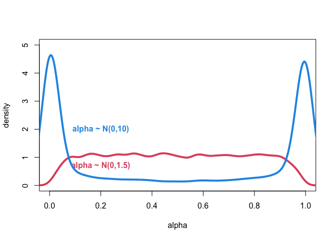<!-- -->

### Model fitting

``` r
dat <- list(
  N = d1$applications,
  A = d1$awards,
  G = ifelse(d1$gender=='f',1,2),
  D = as.integer(d1$discipline)
)
```

``` r
m1 <- cmdstan_model("stancode/m1.stan")
fit1 <- m1$sample(data=dat, chains=4, parallel_chains=getOption("mc.core",4))
summary1 <- as.data.frame(fit1$summary(c("a")))
summary1
```

    ##   variable      mean    median         sd        mad        q5       q95
    ## 1     a[1] -1.738504 -1.739265 0.08128572 0.08173574 -1.873004 -1.605542
    ## 2     a[2] -1.533669 -1.532615 0.06551546 0.06435225 -1.642110 -1.426193
    ##       rhat ess_bulk ess_tail
    ## 1 1.000546 3252.583 2572.181
    ## 2 1.000828 3965.145 2796.203

``` r
draws1 <- fit1$draws()
```

### Model dianosing

The Markov Chain Monte Carlo (MCMC) sampling performs properly as all
four chains mix together. The number of efficient samples and rhat
indicator show no potential warnings. We can move forward onto the
inference step

``` r
bayesplot::mcmc_trace(draws1, regex_pars = c('a'))
```

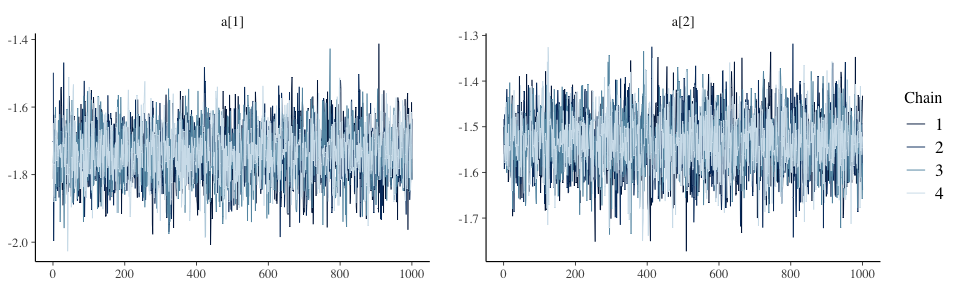<!-- -->

### Model sampling

Sampling from the Bayesian model above, we focus on the gender contrast
on probability scale. The point is that female scholars seem to be less
advantaged than their male counterparts. The quantitative bias is almost
3%. The is a critical number as the success rate of a grant is only
around 20%. However, as we discussed before, that bias covers a total
effect of gender on awards. We must know the direct effect of gender on
awards before making any conclusions about gender discrimination

``` r
x1 = inv_logit(extract_variable(draws1, variable = sprintf("a[1]")))
x2 = inv_logit(extract_variable(draws1, variable = sprintf("a[2]")))
diff_prob_G1 <- x1 - x2
```

``` r
dens(diff_prob_G1, lwd=2, col=2, xlab="Gender contrast (probability)", ylab="Density")
abline(v=0,lty=3)
```

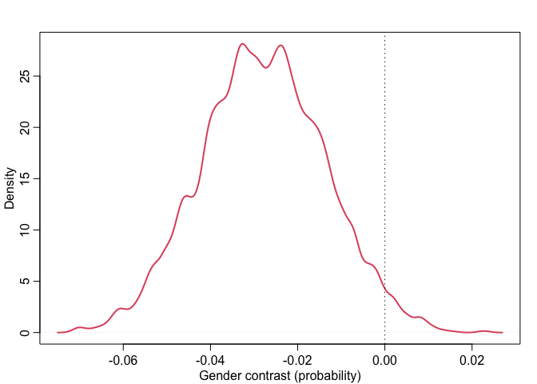<!-- -->

# Direct effect of gender on grant awards

## No-pooling statistical models

We are considering a base case without an unobserved variable. So, to
measure the direct effect of gender on grant awards, we need to separate
it from the total effect and close the path going through the discipline
by conditioning on D. Statistically, we need to add D into the model. By
combining G and D, the parameter, a, will be a matrix with shape of 2
genders and 9 disciplines


### Model fitting

``` r
m2 <- cmdstan_model("stancode/m2.stan")
fit2 <- m2$sample(data=dat, chains=4, parallel_chains=getOption("mc.core",4))
summary2 <- as.data.frame(fit2$summary(c("a")))
summary2
```

    ##    variable       mean    median        sd       mad        q5         q95
    ## 1    a[1,1] -1.0316659 -1.020350 0.3494212 0.3467431 -1.622262 -0.46612805
    ## 2    a[2,1] -1.0061001 -1.000400 0.2492929 0.2504252 -1.428903 -0.60401050
    ## 3    a[1,2] -1.7664804 -1.758030 0.2517803 0.2416045 -2.193102 -1.35139450
    ## 4    a[2,2] -1.1229653 -1.118305 0.1786775 0.1779261 -1.421050 -0.83119940
    ## 5    a[1,3] -1.4217936 -1.418790 0.1980376 0.1962295 -1.756216 -1.09823650
    ## 6    a[2,3] -1.7711243 -1.766900 0.1865216 0.1858810 -2.088881 -1.46285450
    ## 7    a[1,4] -1.2576829 -1.253935 0.2606089 0.2548886 -1.701006 -0.83760960
    ## 8    a[2,4] -1.9950824 -1.985975 0.2919489 0.2735545 -2.487731 -1.51970950
    ## 9    a[1,5] -2.0507941 -2.045525 0.1965641 0.2005810 -2.383352 -1.73431750
    ## 10   a[2,5] -1.4552574 -1.448810 0.1630117 0.1606842 -1.729508 -1.18746650
    ## 11   a[1,6] -1.1579936 -1.146170 0.3679092 0.3634149 -1.789996 -0.57294240
    ## 12   a[2,6] -1.4141175 -1.407895 0.2118639 0.2040132 -1.767053 -1.06916450
    ## 13   a[1,7] -1.0762263 -1.058125 0.7210566 0.7004966 -2.317597  0.05845763
    ## 14   a[2,7] -0.9804392 -0.974199 0.2690100 0.2604053 -1.446774 -0.54061435
    ## 15   a[1,8] -2.0299325 -2.026155 0.1507038 0.1507359 -2.282580 -1.78894000
    ## 16   a[2,8] -1.7068723 -1.703515 0.1340669 0.1343236 -1.931715 -1.49343800
    ## 17   a[1,9] -1.2964519 -1.285850 0.2990281 0.2953784 -1.816750 -0.82563330
    ## 18   a[2,9] -1.6503921 -1.646515 0.1925697 0.1971858 -1.970892 -1.33677350
    ##        rhat  ess_bulk ess_tail
    ## 1  1.002015 10167.189 2861.886
    ## 2  1.004247 10110.463 2270.349
    ## 3  1.001044  9256.190 2650.980
    ## 4  1.000900 10411.187 3037.640
    ## 5  1.003262  9701.226 3035.056
    ## 6  1.001334 10199.118 3028.152
    ## 7  1.001237 10005.520 3134.307
    ## 8  1.000767  9605.012 3333.710
    ## 9  1.000336  9771.394 2685.097
    ## 10 1.000971 11260.141 2983.848
    ## 11 1.003040 10447.924 2695.887
    ## 12 1.002134  8910.163 3200.873
    ## 13 1.003549  8985.052 2734.266
    ## 14 1.002260  9614.207 2965.040
    ## 15 1.003754  8916.692 3021.300
    ## 16 1.001616 10741.370 3135.184
    ## 17 1.000877  9390.292 3200.797
    ## 18 1.002338 10705.818 2918.587

``` r
draws2 <- fit2$draws()
```

### Model dianosing

There are no clear clues regarding of issues in the sampling process. We
can safely move forward

``` r
bayesplot:: mcmc_trace(draws2, regex_pars = c("a"))
```

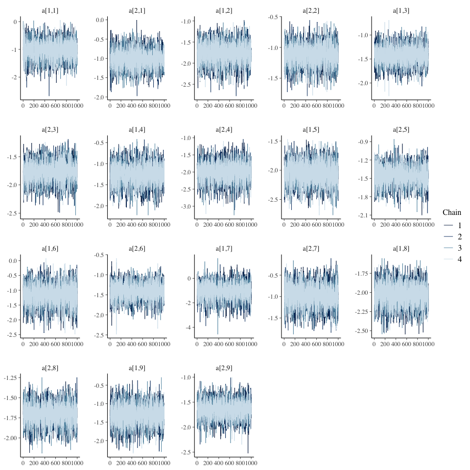<!-- -->

### Model sampling

Different to the first contrast figure, adding D into the model actually
reveals the hidden discrepancies among grant awards in each disciplines.
Female scholars are expected to have higher success rates in disciplines
of humanities, interdisciplinary, technical sciences. Male scholars are
positive about Earth/life sciences, Medical sciences, and Social
sciences

``` r
diff_prob_G2 <- matrix(0,nrow=4000,ncol=9)
for(i in 1:9){
  x1 = inv_logit(extract_variable(draws2, variable = sprintf("a[1,%d]",i)))
  x2 = inv_logit(extract_variable(draws2, variable = sprintf("a[2,%d]",i)))
  diff_prob_G2[,i] = x1 - x2
}
```

``` r
plot(NULL, xlim=c(-0.2,0.3), ylim=c(0,20), xlab="Gender contrast (probability)", ylab="Density")
disc <- as.character(d1$discipline)
disc <- disc[order(dat$D)]
for(i in 1:9){
  dens(diff_prob_G2[,i], lwd=2, col=i, add=T)
  xloc <- ifelse(mean(diff_prob_G2[,i]) < 0, -0.2, 0.2)
  xpos <- ifelse(mean(diff_prob_G2[,i]) < 0, 4, 2)
  text(xloc - 0.5*mean(diff_prob_G2[,i]), 18-i, disc[2*i], col=i, pos=xpos, font=2)
  abline(v=0,lty=3)
}
```

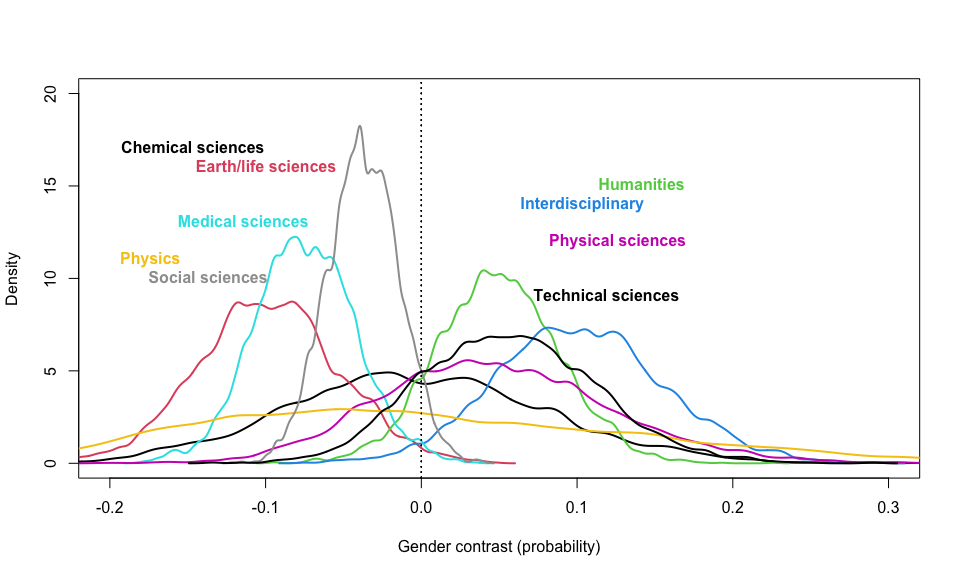<!-- -->

In addition to the contrast figure, we want to compare our model’s
posterior prediction with the input data. There are a large room to
improve the performance of the model as seen in the figure below. The
filled red and blue points represent for the empirical success rates of
females and males, respectively. Obviously, females are favored over
males in some disciplines, vice versa. However, we can clearly see that
the current posterior prediction is largely variant in compared with the
input data. For example, the discipline #7 experiences a wide range of
89% percentile intervals

To cure the issue, we are going to build a hierarchical or partial
pooling model that is expected to allows our model learning across
observations

``` r
dat_sim <- list(gid = rep(1:2, times=9), disc_id = dat$D)
admit_post2 <- matrix(0, nrow=4000, ncol=18)
for(i in 1:18){
  admit_post2[,i] = inv_logit(extract_variable(draws2, sprintf("a[%d,%d]",dat_sim$gid[i],dat_sim$disc_id[i])))
}
```

``` r
admit_mu2 <- apply(admit_post2, 2, mean)
admit_pi2 <- apply(admit_post2, 2,PI, prob=0.89)
```

``` r
plot(NULL, xlim=c(1,18),ylim=c(0,0.6),
     xlab="discipline and gender", ylab="probability", xaxt="n", yaxt="n")
axis(side=2,at=seq(0,0.6,by=0.2), labels=c(0.0,0.2,0.4,0.6))
axis(side=1,at=seq(1,18,by=1), labels=seq(1,18,by=1))

points(x=1:18, y=admit_mu2, pch=10)
for(i in 1:18){points(x=rep(i,2), y=admit_pi2[,i], pch=3)}

for(i in 1:18){
  points(x=i, y=dat$A[i]/dat$N[i], pch=19, col=ifelse(i%%2 == 0,4,2))
}

for(i in 1:9){lines(x=c(2*i-1,2*i),y=c(dat$A[2*i-1]/dat$N[2*i-1],dat$A[2*i]/dat$N[2*i]))}
for(i in 1:9){text(x=2*i-0.5,y=mean(c(dat$A[2*i-1]/dat$N[2*i-1],dat$A[2*i]/dat$N[2*i]))+0.2,
                   labels = concat("disc ",dat$D[2*i]), font=1)}
```

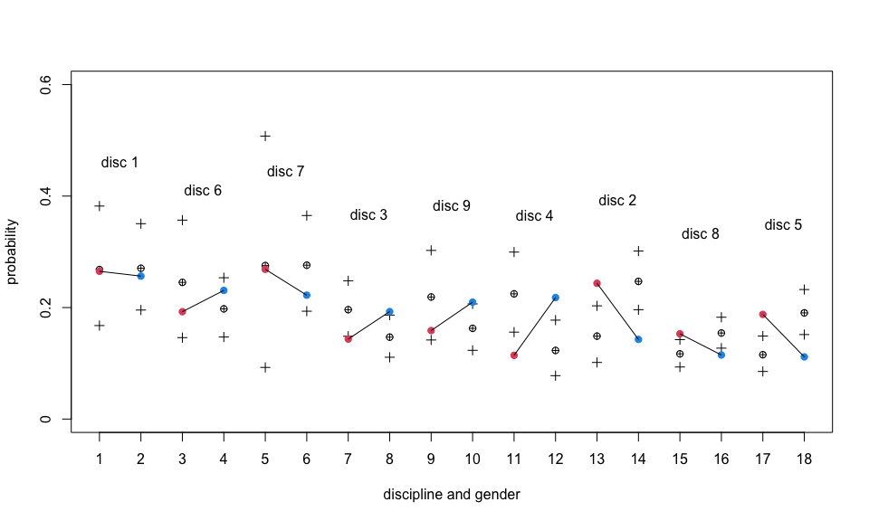<!-- -->

## Partial pooling statistical model

In the model, we introduce three additional variables of a_bar and
sigma. Intuitively, the preceding model implies an infinite variance
among the a parameters. Here, the parameter shares a common distribution
constructed by the three new parameters which are estimated from the
data. Another noteworthy point is that we are using a non-centered
parameterization to improve the sampling process of the MCMC


### Model fitting

``` r
m3 <- cmdstan_model('stancode/m3.stan')
fit3 <- m3$sample(data=dat, chains=4, parallel_chains=getOption('mc.core',4))
summary3 <- as.data.frame(fit3$summary(c("a", "a_bar", "sigma")))
summary3
```

    ##    variable       mean     median         sd        mad         q5        q95
    ## 1    a[1,1] -1.3822406 -1.3904100 0.23963174 0.23510330 -1.7568405 -0.9559859
    ## 2    a[2,1] -1.2742809 -1.2812500 0.21609207 0.22024023 -1.6174665 -0.9126825
    ## 3    a[1,2] -1.6891388 -1.6826750 0.19196981 0.18582167 -2.0151825 -1.3949295
    ## 4    a[2,2] -1.2800723 -1.2817200 0.17520694 0.17414620 -1.5688550 -0.9948421
    ## 5    a[1,3] -1.4770765 -1.4751500 0.16137163 0.15969826 -1.7370805 -1.2145065
    ## 6    a[2,3] -1.7172656 -1.7100050 0.16000521 0.15780053 -1.9933515 -1.4653710
    ## 7    a[1,4] -1.4191426 -1.4174500 0.20963749 0.20608881 -1.7664885 -1.0758995
    ## 8    a[2,4] -1.7928931 -1.7838450 0.21298989 0.19739336 -2.1664455 -1.4672770
    ## 9    a[1,5] -1.9064354 -1.8968700 0.17035007 0.17218916 -2.1988770 -1.6458275
    ## 10   a[2,5] -1.4957170 -1.4948450 0.14036772 0.13976470 -1.7266930 -1.2650015
    ## 11   a[1,6] -1.4352638 -1.4413950 0.24142462 0.23057395 -1.8134405 -1.0226555
    ## 12   a[2,6] -1.4808142 -1.4850600 0.17333626 0.17122547 -1.7636320 -1.1925110
    ## 13   a[1,7] -1.5161194 -1.5332700 0.30020575 0.27127132 -1.9852935 -1.0016475
    ## 14   a[2,7] -1.2919313 -1.3019200 0.22432404 0.22271617 -1.6476190 -0.9218428
    ## 15   a[1,8] -1.9257899 -1.9228450 0.14182768 0.14189965 -2.1639875 -1.6949700
    ## 16   a[2,8] -1.6826462 -1.6808900 0.12022947 0.11768879 -1.8878355 -1.4881095
    ## 17   a[1,9] -1.4568480 -1.4637350 0.22175888 0.22487335 -1.8085910 -1.0812050
    ## 18   a[2,9] -1.6328094 -1.6269150 0.16010496 0.15454622 -1.9045290 -1.3781925
    ## 19    a_bar -1.5461427 -1.5489000 0.09482562 0.08897083 -1.6957120 -1.3873470
    ## 20    sigma  0.2900326  0.2804705 0.09054575 0.08416201  0.1577216  0.4487851
    ##         rhat ess_bulk ess_tail
    ## 1  1.0014077 4675.568 3322.991
    ## 2  1.0004083 4010.488 2710.819
    ## 3  1.0004901 6022.944 3034.982
    ## 4  1.0013645 4198.650 2731.357
    ## 5  1.0006669 5722.629 3643.205
    ## 6  1.0010809 5859.182 3193.757
    ## 7  1.0026703 5130.209 3541.258
    ## 8  1.0008814 4901.463 2698.687
    ## 9  0.9997703 4713.969 2933.219
    ## 10 1.0000243 6327.029 3452.504
    ## 11 1.0003192 4668.250 2963.967
    ## 12 1.0000872 6230.134 3318.464
    ## 13 1.0010141 4074.955 3194.391
    ## 14 1.0007540 4251.107 2902.247
    ## 15 1.0003025 4689.733 3137.406
    ## 16 1.0017980 6851.197 3504.788
    ## 17 1.0000324 5095.902 3267.803
    ## 18 1.0010192 6093.714 3318.363
    ## 19 1.0006543 1716.083 2092.229
    ## 20 1.0023595 1563.185 1933.685

``` r
draws3 <- fit3$draws()
```

### Model diagnosing

The mixing is appropriate although there are some divergence in the
sampling process. We will see the k value in pareto-smoothed importance
sampling cross-validation (PSIS) later

``` r
bayesplot::mcmc_trace(draws3, regex_pars = c("a"))
```

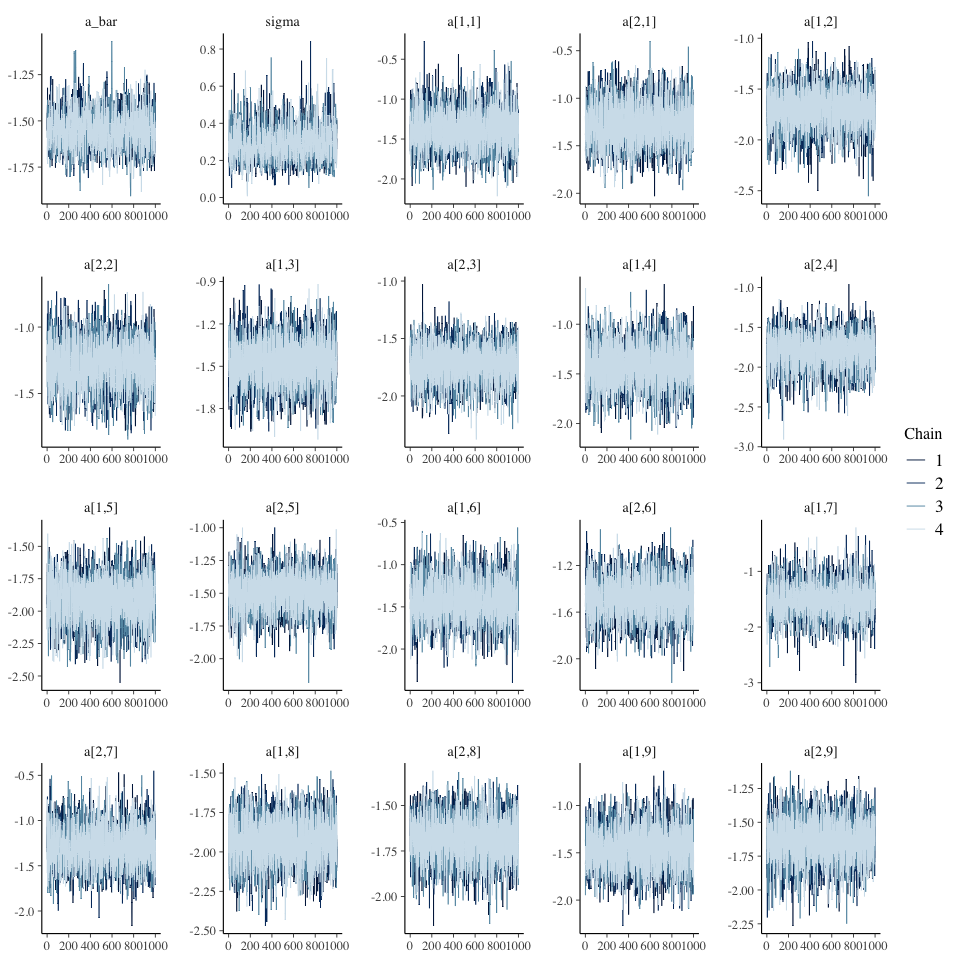<!-- -->

### Model sampling

In comparison with the previous gender contrast figure, the most
important change is that the estimated distributions of disciplines move
closer to zero. That comes from the power of a hierarchical model which
extracts cross-sample information during its sampling process

``` r
diff_prob_G3 <- matrix(0,nrow=4000,ncol=9)
for(i in 1:9){
  x1 = inv_logit(extract_variable(draws3, variable = sprintf("a[1,%d]",i)))
  x2 = inv_logit(extract_variable(draws3, variable = sprintf("a[2,%d]",i)))
  diff_prob_G3[,i] = x1 - x2
}
```

``` r
plot(NULL, xlim=c(-0.2,0.3), ylim=c(0,20), xlab="Gender contrast (probability)", ylab="Density")
disc <- as.character(d1$discipline)
disc <- disc[order(dat$D)]
for(i in 1:9){
  dens(diff_prob_G3[,i], lwd=2, col=i, add=T)
  xloc <- ifelse(mean(diff_prob_G3[,i]) < 0, -0.2, 0.2)
  xpos <- ifelse(mean(diff_prob_G3[,i]) < 0, 4, 2)
  text(xloc - 0.5*mean(diff_prob_G3[,i]), 18-i, disc[2*i], col=i, pos=xpos, font=2)
  abline(v=0,lty=3)
}
```

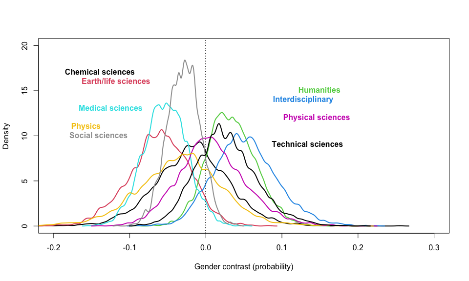<!-- -->

One more step, we can see that our estimates have improved much better
and the percentile intervals have been shortened significantly. The
success rates tend to converge into the global mean around 20%

``` r
dat_sim <- list(gid = rep(1:2, times=9), disc_id = dat$D)
admit_post3 <- matrix(0, nrow=4000, ncol=18)
for(i in 1:18){
  admit_post3[,i] = inv_logit(extract_variable(draws3, sprintf("a[%d,%d]",dat_sim$gid[i],dat_sim$disc_id[i])))
}
```

``` r
admit_mu3 <- apply(admit_post3, 2, mean)
admit_pi3 <- apply(admit_post3, 2,PI, prob=0.89)
```

``` r
plot(NULL, xlim=c(1,18),ylim=c(0,0.6),
     xlab="discipline and gender", ylab="probability", xaxt="n", yaxt="n")
axis(side=2,at=seq(0,0.6,by=0.2), labels=c(0.0,0.2,0.4,0.6))
axis(side=1,at=seq(1,18,by=1), labels=seq(1,18,by=1))

points(x=1:18, y=admit_mu3, pch=10)
for(i in 1:18){points(x=rep(i,2), y=admit_pi3[,i], pch=3)}

for(i in 1:18){
  points(x=i, y=dat$A[i]/dat$N[i], pch=19, col=ifelse(i%%2 == 0,4,2))
}

for(i in 1:9){lines(x=c(2*i-1,2*i),y=c(dat$A[2*i-1]/dat$N[2*i-1],dat$A[2*i]/dat$N[2*i]))}

for(i in 1:9){text(x=2*i-0.5,y=mean(c(dat$A[2*i-1]/dat$N[2*i-1],dat$A[2*i]/dat$N[2*i]))+0.2,
                   labels = concat("disc ",dat$D[2*i]), font=1)}
```

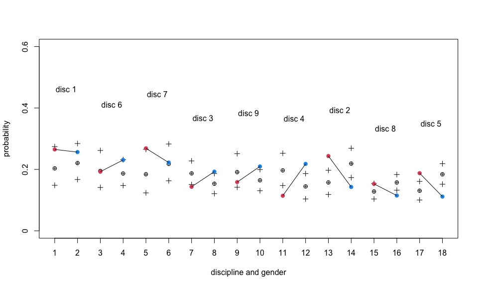<!-- -->

# Model comparison

By using PSIS as a comparing criteria, we see that the third model, a
hierarchical model, has a higher posterior predictive accuracy than the
other two. There are warnings of some high Pareto k values. Those are
insignificant here. We will move on and evaluate the causal effect of
gender onto awards by using the sampling from the third model

``` r
loo1 <- fit1$loo()
loo2 <- fit2$loo()
loo3 <- fit3$loo()
```

``` r
loo_compare(loo1, loo2, loo3)
```

    ##        elpd_diff se_diff
    ## model3  0.0       0.0   
    ## model2 -2.9       2.3   
    ## model1 -6.6       2.4

# Causal effects

Previously, we see the discrepancies of grant funding rates among
disciplines. To make a conclusions about the potential gender
discrimination, we need to calculate the average causal effects based on
the observational data

## Stratification

The first method is to weight the posterior prediction of direct effects
of gender onto each disciplines in proportion to the number of
applications in the sample. The below figure’s mean is slightly
negative, which implies a potential discrimination. Because of the tiny
value, we need to do two extra things, 1) collecting more data to
confirm the gender gap, 2) finding a way to proxy the unobserved
variable. In the opening DAG, the unobserved variable is a confounder of
D and A. By conditioning on D, we unintentionally open a backdoor path
between G and A

``` r
male_app <- d1$applications[d1$gender == 'm']
female_app <- d1$applications[d1$gender == 'f']
male_prop <- male_app / sum(male_app)
female_prop <- female_app / sum(female_app)
```

``` r
female_prob <- matrix(0,nrow=4000,ncol=9)
male_prob <- matrix(0,nrow=4000,ncol=9)
for(i in 1:9){
  female_prob[,i] = inv_logit(extract_variable(draws3, variable = sprintf("a[1,%d]",i)))
  male_prob[,i] = inv_logit(extract_variable(draws3, variable = sprintf("a[2,%d]",i)))
}
```

``` r
female_avg <- female_prob %*% female_prop
male_avg <- male_prob %*% male_prop
```

``` r
dens( female_avg - male_avg , lwd=4 , col=2 , xlab="effect of gender" )
abline(v=0,lty=3)
```

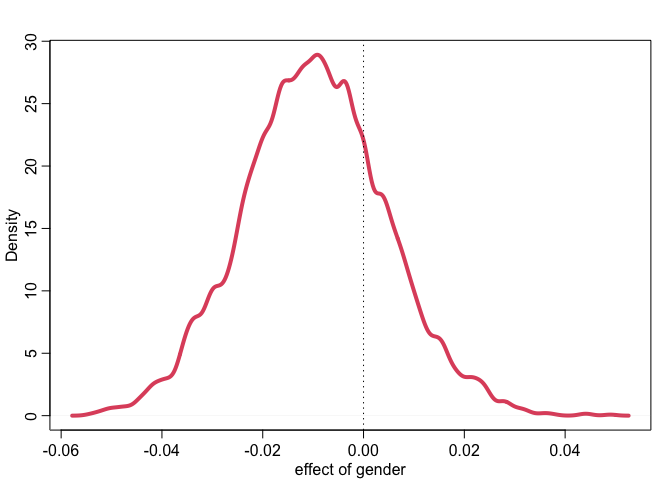<!-- -->

## Creating a pseudo-population

The second method is to do an intervation by creating a
pseudo-population. We are going to generate a simulation that in each
stratum of discipline every applicants have the same gender status. In
the lecture of Stat rethinking 2022, Richard referred it to an
artificial variable of gender perception that lies in the direct causal
path between G and A, and has no connection with D

The diagram shares a similar conclusion with the preceding one as the
contrast distribution’s mean is slightly negative

``` r
total_apps <- sum(dat$N)
apps_per_disc <- sapply(1:9, function(i){
  sum(dat$N[dat$D == i])
})
```

``` r
# simulate as if all apps from women
dat_sim1 <- list(
    D=rep(1:9,times=apps_per_disc),
    N=rep(1,total_apps),
    G=rep(1,total_apps))
```

``` r
# simulate as if all apps from men
dat_sim2 <- list(
    D=rep(1:9,times=apps_per_disc),
    N=rep(1,total_apps),
    G=rep(2,total_apps))
```

``` r
p_g1 <- matrix(0,nrow=4000,ncol=total_apps)
p_g2 <- matrix(0,nrow=4000,ncol=total_apps)
for(i in 1:total_apps){
  p_g1[,i] = inv_logit(extract_variable(draws3, variable = sprintf("a[1,%d]",dat_sim1$D[i])))
  p_g2[,i] = inv_logit(extract_variable(draws3, variable = sprintf("a[2,%d]",dat_sim2$D[i])))
}
```

``` r
dens( p_g1 - p_g2 , lwd=4 , col=2 , xlab="effect of gender perception" )
abline(v=0,lty=3)
```

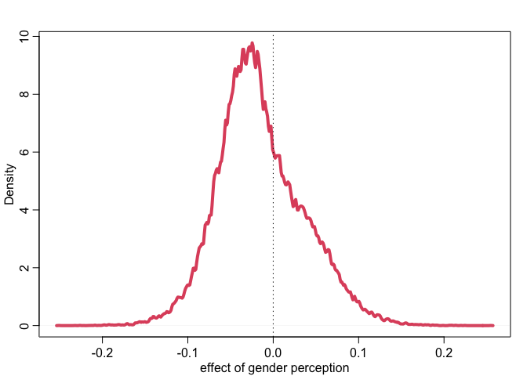<!-- -->

# References

Van der Lee, R., & Ellemers, N. (2015). Gender contributes to personal
research funding success in The Netherlands. Proceedings of the National
Academy of Sciences, 112(40), 12349-12353.

McElreath, R. (2020). Statistical rethinking: A Bayesian course with
examples in R and Stan. Chapman and Hall/CRC.

Pearl, J., & Mackenzie, D. (2018). The book of why: the new science of
cause and effect. Basic books.
